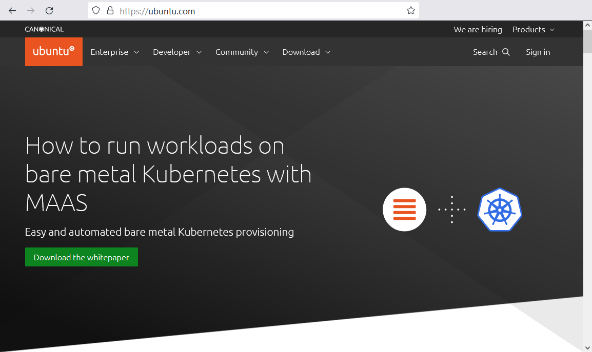
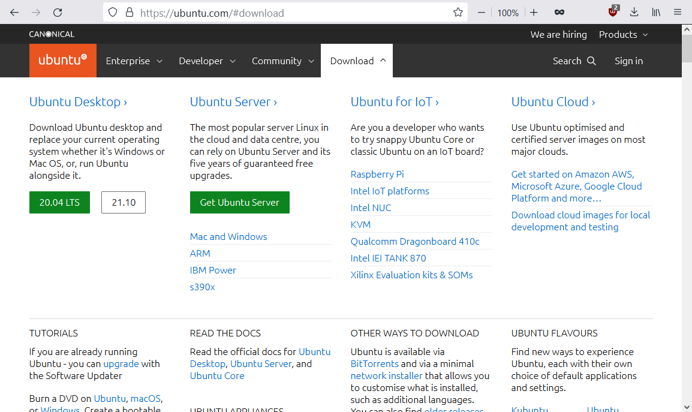
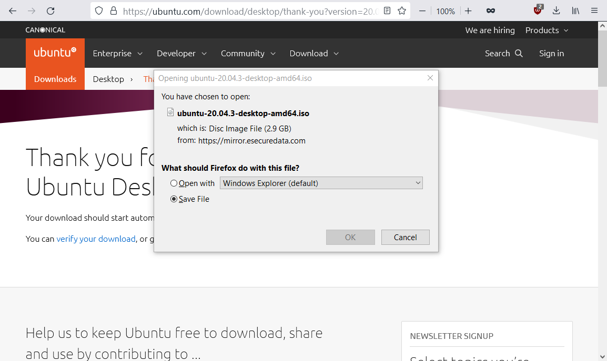
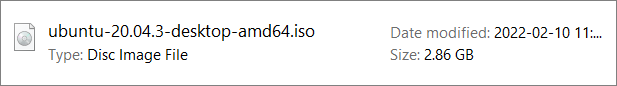

# Download the Ubuntu Disk Image

These steps will guide you to to download an Ubuntu LTS installation disk image.

**Step 1**. Head to [ubuntu.com](https://ubuntu.com/). 

**Step 2**. Navigate to the [Download](https://ubuntu.com/#download) section. 

**Step 3**. Under the Ubuntu Desktop heading, click one of the buttons with version numbers on them.

> **Note**: Unless you have a good reason not to, we recommend to use the **LTS** (long-term support) version as it is considered more stable.

**Step 4**. Take note or find out where your browser saves downloaded files. You will need to know this location on your computer in the steps that follow.

While the download is in progress, you can proceed to [creating a new virtual machine in VirtualBox](https://yaki-bcit.github.io/doc-virtualbox/docs/create-ubuntu-vm/new-vm.html).

When the download completes, you will see a disk image file in your Download folder or another folder you chose for the download.

