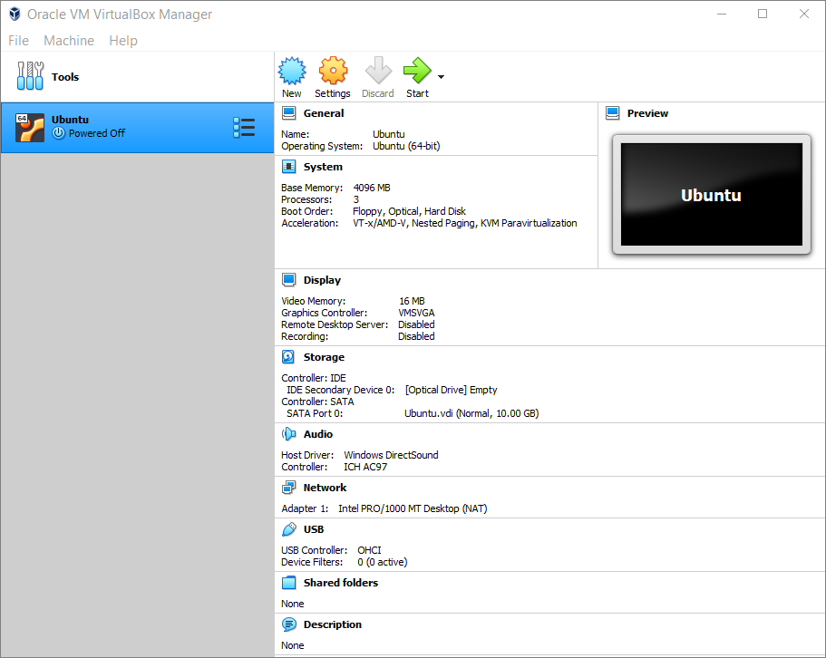

# Install Ubuntu Inside Your New Virtual Machine

This section will help you download a large file, called installation disk image, from which you will install Ubuntu onto your empty virtual machine.

---
## Table of contents
{: .no_toc .text-delta }

1. TOC
{:toc}

---

## Insert the Disk Image into the Virtual Optical Disk Drive

**Step 1**. Select your Ubuntu virtual machine in the left part of the VirtualBox main window. It should be highlighted in blue.

**Step 2**. In the right part of the window, click the “[Optical Drive]” link and choose the Ubuntu installation disk image file that you [downloaded](https://yaki-bcit.github.io/doc-virtualbox/docs/create-ubuntu-vm/download-ubuntu.html).

> **Note**: If you decide to abort the installation process for any reason, VirtualBox may automatically eject the disk image from the virtual optical disk drive. In that case, simply select the disk image again when you run the installation later.

## Install Ubuntu

> **Warning**: Installation may take between 10 and 40 minutes. Do not do any other work on your computer for this duration. 

> **Warning**: After you click "Install Now" in Step 5, it is difficult and undesirable to turn off your virtual machine or your computer. Moreover, your computer may slow down due to intensive disk and memory operations. 

**Step 1**. In the main window of VirtualBox, make sure that your Ubuntu machine is selected (highlighted blue), and click the green Start button. A new window will appear on your screen. This is the virtual screen of your virtual machine.

> **Note**: You can also start the machine by clicking “Machine > Start > Normal Start” from the main menu of VirtualBox, or by calling a context menu for your Ubuntu machine in the list and selecting “Start > Normal Start”. 

**Step 2**. Wait until you see an invitation to try or install Ubuntu and select “Install Ubuntu”.

> **Note**: You can safely close the notifications about mouse pointer integration and keyboard capture by clicking the small blue ‘x’ button on each.

**Step 3**. Continue in the wizard with English as the interface and keyboard language.

> **Note**: As you can see in the screenshot above, the virtual screen does not fit the whole window, and the buttons at the bottom are only partially visible. This inconvenience can be easily eliminated after installation.

**Step 4**. On the “Updates and other software” screen, select the type of installation. For Level 1 courses at BCIT, “Minimal installation” is sufficient; besides, it takes less time and disk storage.

> **Note**: For the purposes of BCIT courses and since you are installing Ubuntu virtually, you don't need to select the "Install third-party software" option.

**Step 5**. Make sure that “Erase disk and install Ubuntu” is selected. Disregard the warning about program and file deletion. Click "Install Now" at the bottom.

> **Note**: Since you are installing Ubuntu in a newly created virtual machine, the virtual hard drive should be empty anyway.

**Step 6**. Click "Continue" to confirm.

**Step 7**. Choose your approximate location on the map or type the or type the name of the closest large city in the text field below. Click "Continue".

**Step 8**. Type your username and password. Make sure you write down, save or remember the password because you WILL need it later. Select "Log in automatically". Click "Continue".

**Step 10**. Wait until the installer finishes all its operations. This is the longest step. In the meantime, you may want to read the Ubuntu presentation on the virtual screen.

> **Note**: After successful installation of Ubuntu inside the VM, you will not need the downloaded disk image to run the VM, so you can safely delete it to free up storage space.

**Step 11**. Click "Restart Now".

**Step 12**. Press Enter on your keyboard when prompted.

> **Note**: Technically, your virtual machine is already installed. However, once it restarts, you will need to take a few [first steps](https://yaki-bcit.github.io/doc-virtualbox/docs/create-ubuntu-vm/first-steps.html)
