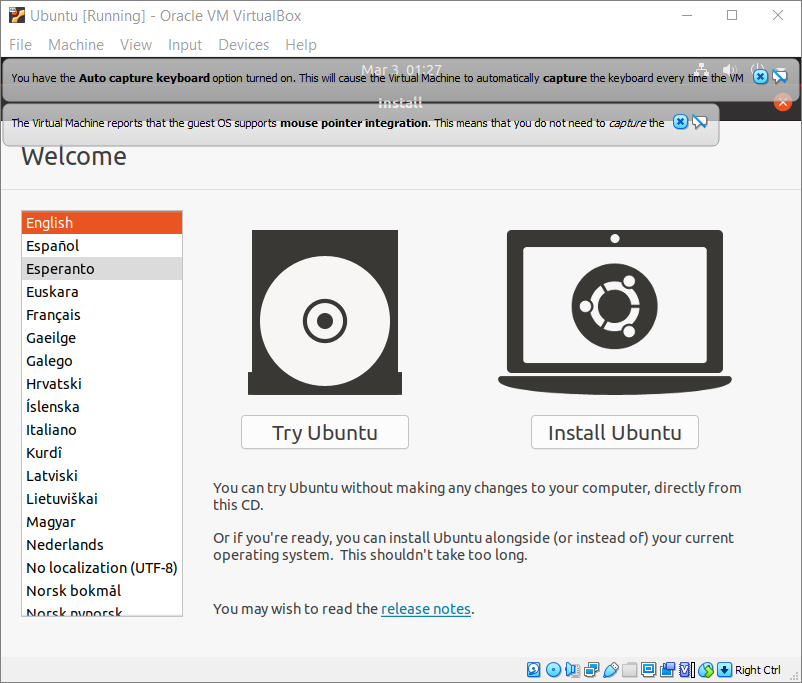

## Table of contents
{: .no_toc .text-delta }

1. TOC
{:toc}

---

# Install Ubuntu Inside Your New Virtual Machine

## Insert the Disk Image into the Virtual Optical Disk Drive

**Step 1**. Select your Ubuntu virtual machine in the left part of the VirtualBox main window. It should be highlighted in blue.

**Step 2**. In the right part of the window, click the “[Optical Drive]” link and choose the Ubuntu installation disk image file that you [downloaded](https://yaki-bcit.github.io/doc-virtualbox/docs/create-ubuntu-vm/download-ubuntu.html).

> **Note**: If you decide to abort the installation process for any reason, VirtualBox may automatically eject the disk image from the virtual optical disk drive. In that case, simply select the disk image again when you run the installation later.

## Install Ubuntu

**Step 1**. In the main window of VirtualBox, make sure that your Ubuntu machine is selected (highlighted blue), and click the green Start button.

> **Note**: You can also start the machine by clicking “Machine > Start > Normal Start” from the main menu of VirtualBox, or by calling a context menu for your Ubuntu machine in the list and selecting “Start > Normal Start”.

**Step 2**. Wait until you see an invitation to try or install Ubuntu and select “Try Ubuntu”.

> **Note**: Although it might seem a faster route to select “Install”, we have found that this results in difficulties related to the screen size of the virtual machine being too small to show all of the installer window.

> **Note**: You can safely close the notifications about mouse pointer integration and keyboard capture by clicking the small blue ‘x’ button on each.

**Step 3**. Wait until you see the Ubuntu desktop, which should look like the image below.

**Step 4**. Right click in empty space on the VM desktop to see the context menu, and select “Display Settings”.

**Step 5**. Change the resolution to “1024 × 768” and click the green “Apply” button in the top right corner. Click “Keep changes” in the dialog that appears.

**Step 6**. Keep the Settings window open so that you can use it again in case the screen size resets and becomes too small during installation:

  a. Click the minimize button in the top right corner. The minimized Settings window can be found on the taskbar at the bottom left of the screen.
  
**Step 7**. Open the orange “Install Ubuntu” icon on the desktop to start the installation wizard.

**Step 8**. Continue in the wizard with English as the interface and keyboard language.

**Step 9**. On the “Updates and other software” screen, select the type of installation. For Level 1 courses at BCIT, “Minimal installation” is sufficient, takes less time and disk storage.

**Step 10**. Make sure that “Erase disk and install Ubuntu” is selected. Disregard the warning about program and file deletion. Since you are installing Ubuntu in a newly created virtual machine, the virtual hard drive should be empty anyway.
