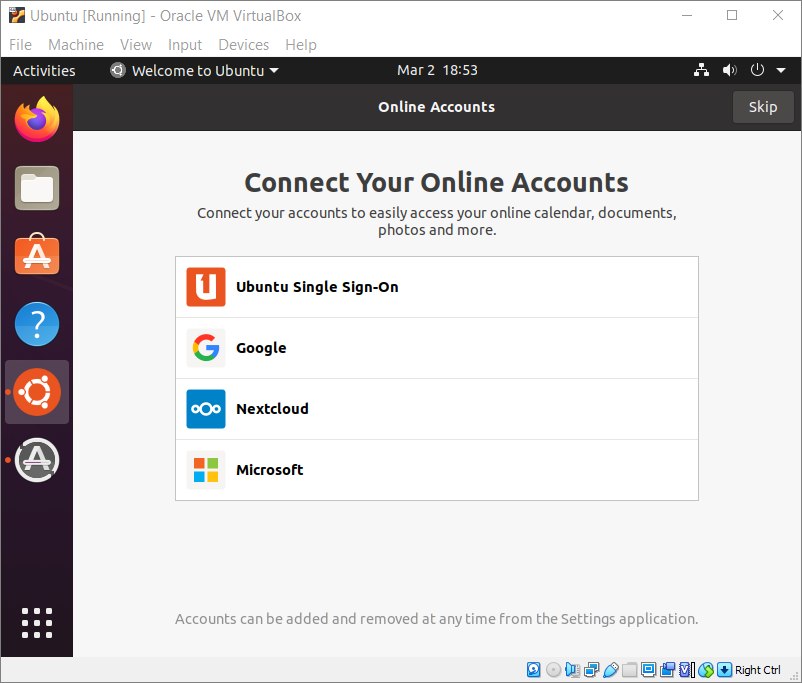
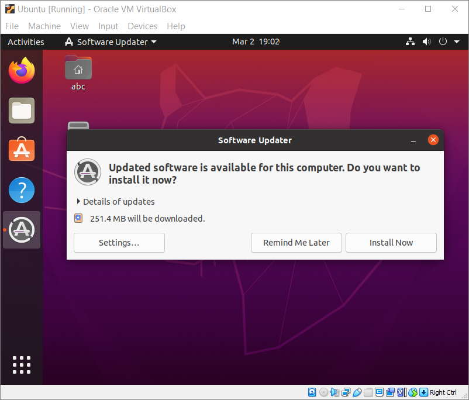
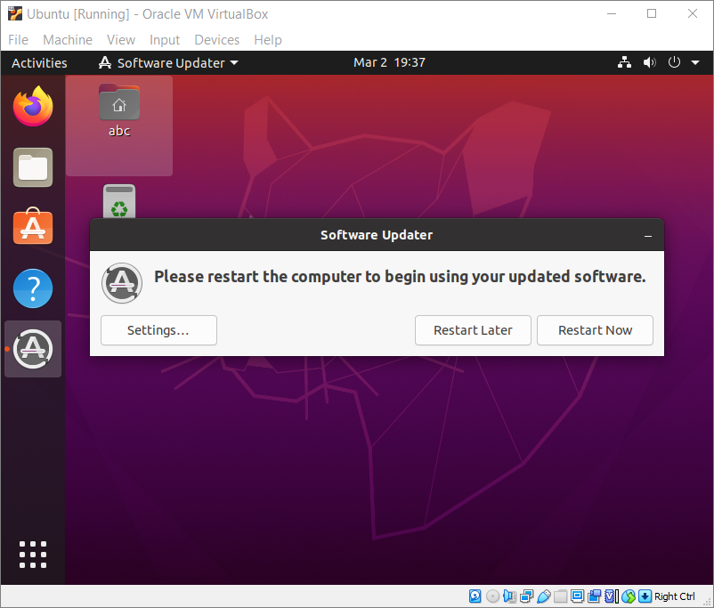
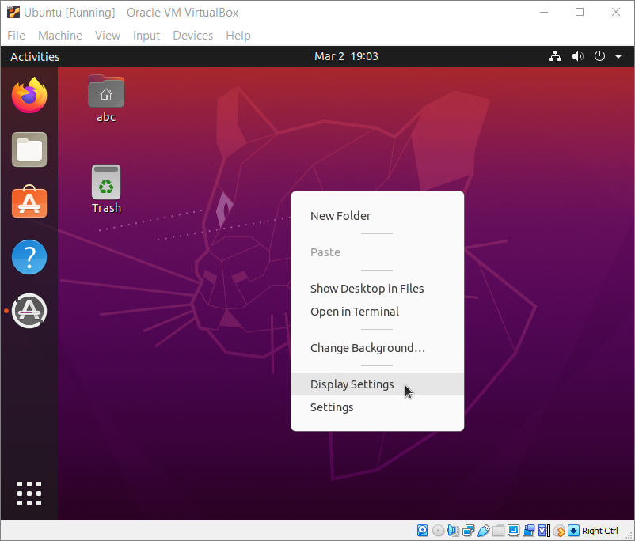
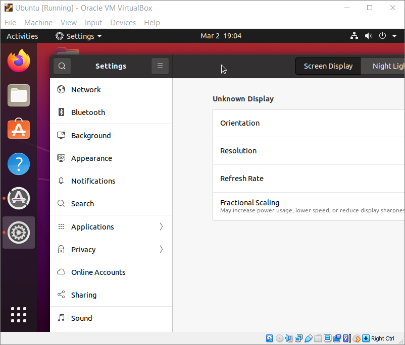
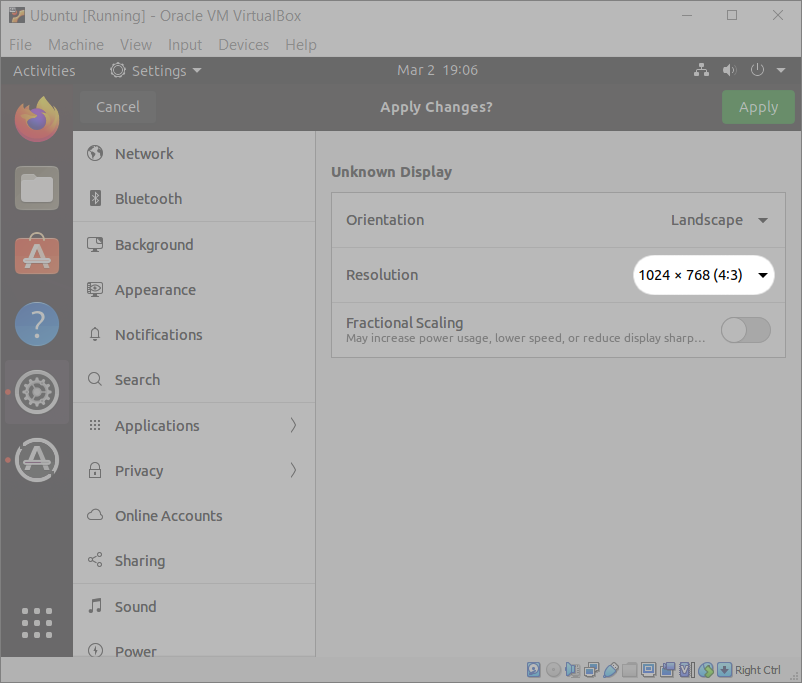
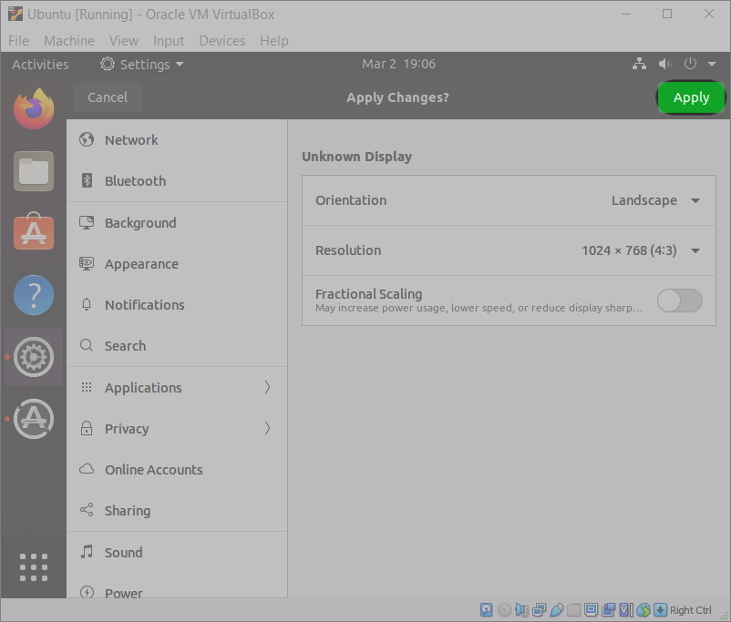
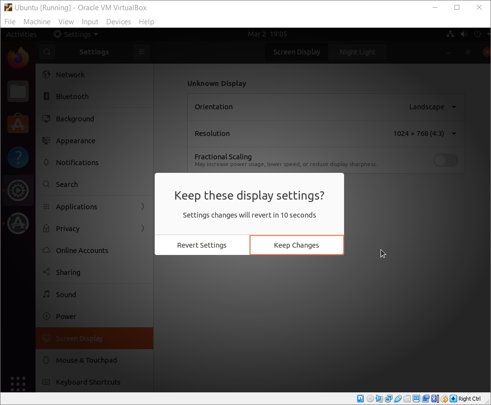
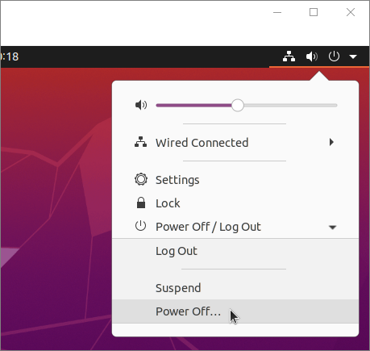
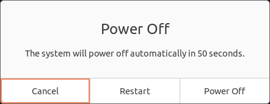

# First Steps in Ubuntu
{: .no_toc }

This section will help you make your first steps in Ubuntu towards some useful knowledge and a comfortable working environment. There is no set order for these steps, so use the table of contents to find the sections you need.

---

## Table of contents
{: .no_toc .text-delta }

1. TOC
{:toc}

---

## Welcome to Ubuntu Wizard

You do not need to make any choices in this wizard, so click "Skip" and "Next" until you see and click "Done" to exit the wizard.

## Software Updater

**Step 1**. Ubuntu will likely prompt you to confirm software update. Click "Install Now".

**Step 2**. After update, the updater may ask you to restart the machine.

## Change Virtual Screen Size

The default virtual screen size of 800 by 600 may be too small for your purposes. You can try to increase it.

**Step 1**. Right-click on Ubuntu desktop and select "Display settings".

**Step 2**. If the window that appears is too large to fit on the screen, double-click its dark top bar.

**Step 3**. Click the drop-down right of Resolution and select "1024 × 768 (4:3)".

**Step 4**. Click the green "Apply" button in the top right.

**Step 5**. Click "Keep Changes".

## Restart or Power Off Ubuntu

It is important to restart or power off your virtual machine properly.

**Step 1**. Click any of the small icons in the top right and click "Power Off/Log Out".

**Step 2**. Select the option you want in the dialog.

## Learn More about Ubuntu

If you want to learn more about Ubuntu, you may find these resources useful:

1. [Official Ubuntu documentation](https://help.ubuntu.com/)
2. [Ubuntu Tutorials](https://ubuntu.com/tutorials)
3. [Questions and answers on Ubuntu](https://askubuntu.com/)

We hope that our guide has helped you well. Check our Troubleshooting section if you have a problem!
