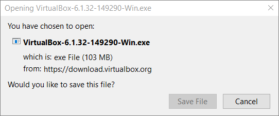

# Install VirtualBox
{: .no_toc }

In this section, you will learn how to get and install the latest version of VirtualBox for Windows.

The download size is approximately 100 MB, and depending on your internet connection speed, it may take from 1 to 10 minutes on most modern connections.

Installation time mostly depends on the type of your storage, although other specifications may also play a minor role.

> **Warning**: The installation involves changes to some deep system settings and creation of virtual hardware such as network adapters. As such, **your computer WILL require a full reboot** after installation. Before you start the installation, **make sure to save and close any open files and close unnecessary programs**.

## Table of contents
{: .no_toc .text-delta }

1. TOC
{:toc}

---

## Download the Redistributable

Head over to [virtualbox.org](https://www.virtualbox.org/) and click the Download button.

The button is hard to miss, but alternatively, you can also click the Downloads(https://www.virtualbox.org/wiki/Downloads) navigation link on the left.

> **Note**: The End-user docs link in the navigation may prove useful as you perfect your virtualization skills and tackle more complex tasks.

The Downloads page offers versions of VirtualBox for different host operating systems. Since your computer runs Windows, click the link that says “**Windows hosts**”.

> **Warning**: It is a common mistake for beginners to download the wrong version of VirtualBox. Remember, it does not matter which guest OS you want to run. What matters is the operating system that is currently installed and running on your computer.

> **Note**:    The Downloads page links to other useful resources, such as the Extension Pack (more on it later) or the full VirtualBox manual.

Once you click the “Windows hosts” link, the browser should prompt you for confirmation. An example is shown below.

Depending on your browser, you may see the options to “Run” or “Save” the file. We recommend saving your file. This is useful because having the downloaded file will let you postpone the installation until the most convenient time.

Depending on the settings of your browser, the downloaded file may be saved in the “Downloads” folder of your user, or the browser may prompt you to select the folder.

In the latter case, select the location that you will remember, so that accessing or deleting the file is easier in the future.

## Install VirtualBox

> **Warning**: Choose installation time wisely. You don’t want any critical process running during installation. Close any unnecessary programs and files before you proceed.

> **Warning**: Make sure that you run installation when your network connection is not critically important.

Although you may be used to installing programs on your computer, installation of VirtualBox involves steps that you may be unfamiliar with. Before you begin, please take at least a quick look at this section to learn what to expect.

One aspect that may be unusual to you is installation of a virtual network adapter. This happens automatically, but you will get a warning that your network, and internet, connection will be temporarily broken.

The above warning will be followed by a prompt to confirm installing virtual network adapter software.

**Note**: If you do not allow the installer to add a virtual network adapter to your computer, your virtual machines will not be able to connect to the internet or your local network.

At the end, the installer will invite you to start VirtualBox.

Now you are ready to [create a virtual machine in VirtualBox](create-vm).
