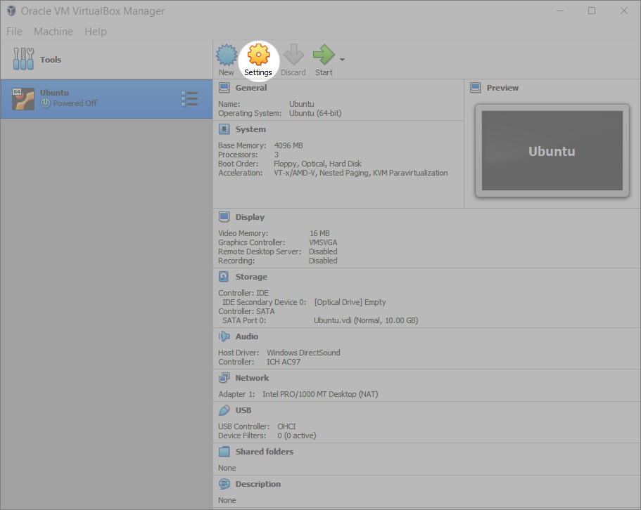

# Troubleshooting
{: .no_toc }

In this section, you'll find solutions to the most frequent difficulties that you may encounter. 

For Ubuntu-specific troubleshooting, consider referring to the the following resources:

1. [Official Ubuntu documentation](https://help.ubuntu.com/)
2. [Ubuntu Tutorials](https://ubuntu.com/tutorials)
3. [Questions and answers on Ubuntu](https://askubuntu.com/)

---

## Table of contents
{: .no_toc .text-delta }

1. TOC
{:toc}

---

## Ubuntu Installer Starts Up in the Virtual Machine after Successful Ubuntu Installation

This means that the disk image is still inserted into the virtual drive.

**Step 1**. Make sure your virtual machine is turned off. Select the virtual machine in the main window of VirtualBox and click the words "[Optical Drive]" in the "Storage" section of the right panel. In the context menu that opens, click "Remove disk from virtual drive".

## Drag-and-Drop or Copy-Paste Doesn't Work between the Host and the Guest OS

These features may not be enabled by default, but can be easily set by the user.

**Step 1**. Make sure your virtual machine is turned off. Select the virtual machine in the main window of VirtualBox and click the orange-yellow "Settings" button.

**Step 2**. In the Settings window, select "General" in the left panel, then click the "Advanced" tab on the right. Select "Bidirectional" in the dropdowns for "Shared clipboard" and "Drag'n'Drop".

