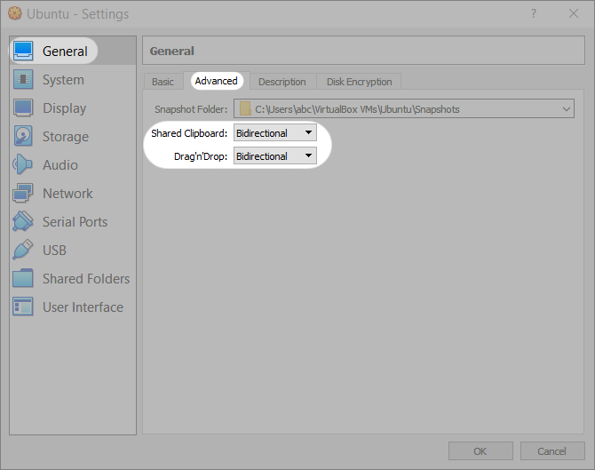
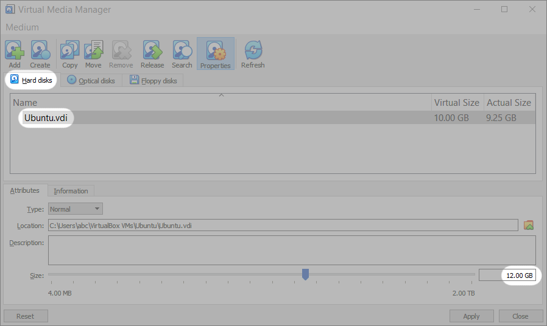

# Troubleshooting
{: .no_toc }

In this section, you'll find solutions to the most frequent difficulties that you may encounter. 

For Ubuntu-specific troubleshooting, consider referring to the the following resources:

1. [Official Ubuntu documentation](https://help.ubuntu.com/)
2. [Ubuntu tutorials](https://ubuntu.com/tutorials)
3. [Questions and answers on Ubuntu](https://askubuntu.com/)

---

## Table of contents
{: .no_toc .text-delta }

1. TOC
{:toc}

---

## The mouse pointer is stuck inside the virtual machine

This means that automatic mouse integration has been turned off for your virtual machine.

**Step 1**. Note the Host key in the right bottom corner of your running virtual machine window. If your host OS is Windows, the Host key is "Ctrl" on the right side of your keyboard. On MacOS hosts, the Host key is the "Command" key on the left. In the example below, the Host key is right "Ctrl".

**Step 2**. Press the Host key on your keyboard.

**Step 3**. To turn mouse integration on, find the mouse integration icon () in the bottom right corner of the virtual machine window, next to the Host key indicator. Right-click the indicator and click "Mouse Integration" in the menu. The indicator should turn blue ().

## Ubuntu Installer starts up in the virtual machine after successful installation of Ubuntu

This means that the disk image is still inserted into the virtual drive.

**Step 1**. Make sure your virtual machine is turned off. In the main window of VirtualBox, select the virtual machine and click the words "[Optical Drive]" in the "Storage" section of the right panel. In the context menu that opens, click "Remove disk from virtual drive".

## Drag-and-drop or copy-paste doesn't work between the host and the guest OS

These features may not be enabled by default, but can be easily set by the user.

**Step 1**. Make sure your virtual machine is turned off. In the main window of VirtualBox, select the virtual machine and click the orange-yellow "Settings" button.

**Step 2**. In the Settings window, select "General" in the left panel, then click the "Advanced" tab on the right. Select "Bidirectional" in the dropdowns for "Shared clipboard" and "Drag'n'Drop". Then you can close the Settings window.

## The guest OS says that the disk is full

This means that the operating system inside your virtual machine has used up all of the disk space that you allocated for it.

**Step 1**. Make sure your physical computer or laptop has sufficient empty space (at least 5GB). To free up extra space, you may need to follow the instructions for [Windows](https://support.microsoft.com/en-us/windows/free-up-drive-space-in-windows-a18fae02-a0fa-8df9-9838-8970f9939de4#WindowsVersion=Windows_10) or [MacOS](https://support.apple.com/en-us/HT206996).

**Step 2**. Make sure your virtual machine is turned off. In the main window of VirtualBox, select the virtual machine on the left and **note the name of the virtual drive** under Storage > Controller: SATA.

**Step 3**. In the main window of VirtualBox, click "File > Virtual Media Manager..." in the top menu.

**Step 4**. In the "**Hard disks**" tab of the Virtual Media Manager window, select **the name of the virtual drive** used in your virtual machine. In the text field at the bottom right, type in the new, slightly bigger size of the virtual drive. In the example below, we increased the size from 10 to 12 GB.

**Step 5**. Click "Apply" at the bottom of the window. Then you can close the Virtual Media Manager window.

## The guest OS does not have an internet connection

This means that either your physical computer or your virtual machine has lost the connection.

**Step 1**. Check whether your computer has an internet connection. If the connection is absent, troubleshoot your Wi-Fi, Ethernet or router, or contact your internet provider. If the connection is good, proceed to Step 2.

**Step 2**. In the main window of VirtualBox, select the virtual machine and click the orange-yellow "Settings" button.

**Step 3**. Click "Network" on the left panel of the Settings window. Make sure the checkbox "Enable Network Adapter" is selected. Select "NAT" in the "Attached to" dropdown. Click OK at the bottom to close the window.

